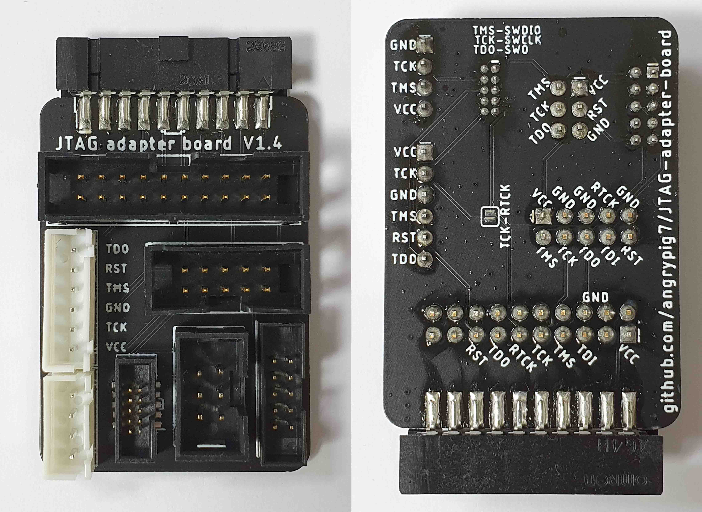

# JTAG-adapter-board
JTAG adapter board with most used connectors

### List of Connectors
* 2.54mm 2*10 pin female socket connector (for connecting to J-Link)
* 2.54mm 2*10 pin IDC male header connector
* 2.54mm 2*5 pin IDC male header connector
* 2.00mm 2*5 pin IDC male header connector
* 1.27mm 2*5 pin IDC male header connector (supports both SMD and PTH)
* 2.54mm 2*3 pin IDC male header connector - for Tag-Connect cable: [TC2030-IDC-NL](https://www.tag-connect.com/product/tc2030-idc-nl)
* 2.54mm 4 pin XH2.54 connector
* 2.54mm 6 pin XH2.54 connector

#### Note
It has different pinout from the usual [Chinese JTAG adapter board sold in green or blue](http://vctec.co.kr/web/product/ale/img/0000156-2.jpg)

Mine follows pinouts from [ARM's website](http://www.keil.com/support/man/docs/ulink2/ulink2_hw_connectors.htm)
